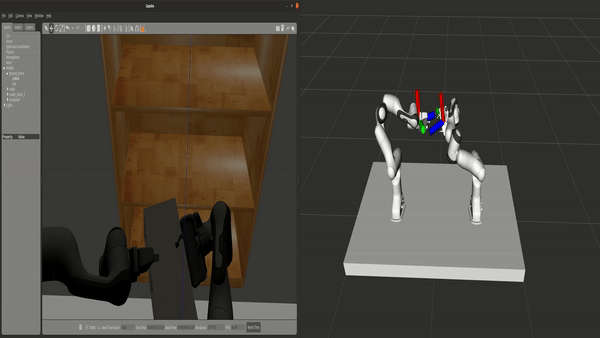

# VR Tracking Data
This repository contains data regarding the [moveit_vive](https://github.com/Machine-Jonte/moveit_vive) VR control system for robots. The system is througly presenented in the MCs thesis (link soon available and BibTeX for the people interested in referring to the work).

<p align="center">
  
</p>

All the packages developed and used for the thesis is in the github repositories below. The code will be released when the thesis is accepted (around end of July 2020).  
  
The data is generated and collected using the ROS packages:  
* [moveit_vive](https://github.com/Machine-Jonte/moveit_vive), used for sending MoveIt commands to robot.
* [control_evaluation](https://github.com/Machine-Jonte/control_evaluation), for recording trajectories and trajectory replay for the statistical shape modeling learning task (using PCA).
* [vive_ros](https://github.com/Machine-Jonte/vive_ros/tree/master), reading controller data and send it as ROS messages (modified version by me).
* [panda_dual_gazebo_moveit_config](https://github.com/Machine-Jonte/panda_dual_gazebo_moveit_config), configuration for MoveIt.
* [panda_dual_gazebo](https://github.com/Machine-Jonte/panda_dual_gazebo), xacro and robot files (modified for working with gazebo). 


# Common Information
To generate 3D trajectory graph run:  
```
cd {where plot_tracking.py is located}
python plot_tracking.py /dir/to/data.csv
```
or  
```
cd {where plot_tracking_two_files.py is located}
python plot_tracking_two_files.py /dir/to/left.csv /dir/to/right.csv
```
To generate 2D graphs run:
```
cd {where plot_graph.py is located}
python plot_graph.py /dir/to/data.csv
```
or
```
cd {where plot_graph.py is located}
python plot_graph_two_files.py /dir/to/left.csv /dir/to/right.csv
```

## Demonstration of using the system to carry an object in simulation
<p align="center">
  
</p>